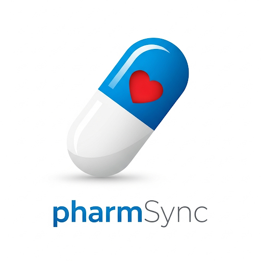
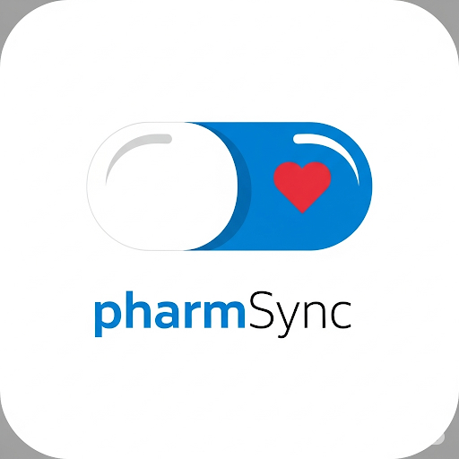
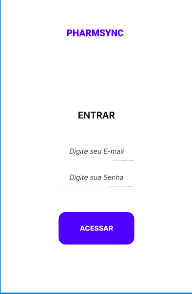

# Projeto Mobile  Controle Pessoas de Receitas/Ingestão de Medicamentos

##  Aplicativos Avaliados

- **Medisafe**
- **WeMeds**
- **MyTherapy**
- **Tomar Remédio**

---

##  1. Medisafe
O Medisafe é um aplicativo móvel projetado para ajudar pacientes a gerenciar seus medicamentos, oferecendo lembretes para tomar remédios na hora certa, rastrear a adesão ao tratamento e compartilhar informações com familiares ou profissionais de saúde. Ele também oferece recursos como o monitoramento de outras medidas de saúde, como pressão arterial, e a possibilidade de compartilhar relatórios com o médico ou plano de saúde. 

 **Pontos Fortes**:
- Interface amigável e intuitiva, com tela inicial em formato de calendário.
- Botões de atalho para adicionar medicamentos de forma rápida.
- Tela de atualizações com funcionalidades como consultas médicas e monitor de saúde.
- Tela dedicada para adição de medicamentos, com layout didático.
- Aba “Mais” com recursos como diário, reposição de medicamentos, configurações e personalização de tema (cor de fundo).

 **Pontos Fracos**:
- Algumas funcionalidades exigem conexão com a internet.
- Ausência de suporte ampliado a idiomas regionais.

---

##  2. WeMeds
O WeMEDS é um aplicativo focado em medicina, desenvolvido para auxiliar estudantes e profissionais da área. Ele oferece recursos como resumos de diversas especialidades, auxílio em diagnósticos com inteligência artificial, e ferramentas para provas e plantões, além de protocolos e calculadoras. 

 **Pontos Fortes**:
- Todas as funcionalidades funcionam offline.
- Abrangente: inclui receitas, prescrições, guias de atividade, verificação de vacinas e flashcards educativos.
- Funcionalidades com inteligência artificial para recomendações de saúde.

 **Pontos Fracos**:
- Interface desatualizada, com design menos moderno.
- Recursos avançados disponíveis apenas na versão paga.

---

##  3. MyTherapy
O MyTherapy é um aplicativo gratuito que funciona como um lembrete de medicamentos e também oferece recursos adicionais para o acompanhamento da saúde, como diário de saúde e registro de medições. Ele é projetado para ajudar pessoas com rotinas complexas ou condições crônicas a manterem seus tratamentos em dia e a monitorarem seu bem-estar. 

 **Pontos Fortes**:
- Interface moderna, com componentes acessíveis a usuários idosos.
- Funcionalidades completas: cadastro de medicamentos, médicos, sintomas, humor e atividades físicas.
- Sistema de notificações eficaz e gráfico de progresso de tratamento.

 **Pontos Fracos**:
- Não possui modo escuro ou opção de alterar o tema visual.
- Algumas funcionalidades exigem login com cadastro.

---

##  4. Tomar Remédio
O aplicativo Tomar Remédio geralmente serve como um lembrete para ajudar as pessoas a lembrarem de tomar seus medicamentos nos horários corretos. Esses aplicativos oferecem diversas funcionalidades, como agendamento de horários, notificações personalizadas e registro da ingestão dos medicamentos. 

**Pontos Fortes**:
- Interface simples e funcional, ideal para usuários brasileiros.
- Cadastro de medicamentos fácil de usar.
- Dashboard com relatório de medicamentos tomados.

 **Pontos Fracos**:
- Algumas funcionalidades ainda estão em desenvolvimento.
- Falta de feedback visual para indicar em qual tela o usuário está(Hover).
- Ausência de recursos avançados como exportação de relatórios ou acompanhamento de sintomas.

---

##  Considerações Finais

Dentre os aplicativos avaliados, **Medisafe** e **MyTherapy** se destacam como os mais completos em termos de recursos e acompanhamento da rotina de saúde, sendo ideais para usuários que necessitam de controle rigoroso de medicamentos e consultas. Já o **WeMeds** oferece uma abordagem mais ampla e educativa da saúde, com diversas funcionalidades adicionais, embora sua interface e limitações na versão gratuita possam ser um obstáculo.

Por outro lado, o app **Tomar Remédio** se sobressai pela simplicidade e objetividade, sendo excelente para usuários que buscam um app prático, sem complexidade e totalmente em português. No entanto, ainda carece de melhorias na interface e em funcionalidades avançadas.

 ##  Proposta de Arquitetura do Software

Com base nas necessidades identificadas como facilidade de uso, notificações de medicamentos, acessibilidade para idosos, funcionamento offline(obrigatório),propomos a seguinte arquitetura para o aplicativo de gerenciamento de medicamentos, e o app serve tanto para IOS quanto para Android:

###  Arquitetura Utilizada:  

A arquitetura será baseada em **camadas independentes**(significa que cada parte do sistema (ou "camada") é responsável apenas por uma função específica e não depende diretamente da implementação das outras camadas,ou seja, elas se comunicam entre si por meio de interfaces, e não de forma acoplada), separando claramente as responsabilidades entre regras de negócio, interface, dados e serviços externos. Isso melhora a **manutenibilidade**, **testabilidade** e **escalabilidade** do projeto.

 ## Tecnologia Ultilizadas:
 - Flutter → Ele permite criar interfaces de usuário atraentes e funcionais para dispositivos móveis (iOS e Android)  
 - SqlLite → É um sistema de gerenciamento de banco de dados relacional (SGBDR).  

 ## Nome Do Aplicativo
 - PharmSync
   
 ## Explicação Bréve Sobre o Nome:
**Pharm** → abreviação de pharmacy ou pharmaceutical, que remete a:  
 - Medicamentos  
 - Farmácias  
 - Tratamentos médicos  
   
**Sync** → abreviação de synchronization, que significa:  
- Sincronizar   
- Conectado em tempo real  
 

 ## Icon Software  
 

 ## Logo Aplicativo  
 

 ## Cores padrão:   
  O aplicativo utilizará uma paleta composta por **branco**, **azul** e **vermelho** e **preto**, buscando uma combinação visualmente agradável, com contraste adequado e boa legibilidade, especialmente para usuários com maior sensibilidade visual (como idosos).

 ## Fonte utilizada:  
  A tipografia escolhida será a **Roboto**, uma fonte clássica e amplamente reconhecida por sua **leitura fácil**, simplicidade e compatibilidade com múltiplos dispositivos e sistemas operacionais.

Essas escolhas visam proporcionar uma **experiência limpa, acessível e coerente**, em sintonia com os melhores padrões de design encontrados nos aplicativos atuais de saúde e bem-estar.

# Interface  
## Menu  
 

 # Proposta de Padrões de Interface, Nomenclatura, Componentes, Variáveis e Boas Práticas

Para garantir a organização, a legibilidade e a manutenção do código-fonte do aplicativo de controle pessoal de receitas e ingestão de medicamentos, serão adotados os seguintes **padrões e boas práticas** durante o desenvolvimento:

---

## 1. Padrões de Nomenclatura

### Variáveis e funções/métodos
- Utilizar o padrão **camelCase**
- Exemplo: `nomeUsuario`, `verificarHorario`, `calcularEstoque`

### Classes e componentes
- Utilizar o padrão **PascalCase**
- Exemplo: `ControleMedicamentos`, `TelaPrincipal`, `NotificacaoService`

---

## 2. Componentes de Interface 

- Os componentes da interface seguirão uma **hierarquia clara**, com nomes coerentes com sua função.
- Exemplos:
  - `btnAdcionar` 
  - `txtNomeMedicamento` 
  - `lblHorario` 
  - `cbxDiasDaSemana` 

---

## 3. Boas Práticas de Programação

- **Código limpo e legível**: utilizar indentação consistente e nomes descritivos.
- **Evitar código duplicado**: preferir funções reutilizáveis.
- **Tratar erros e exceções** com clareza e responsabilidade.  

 
